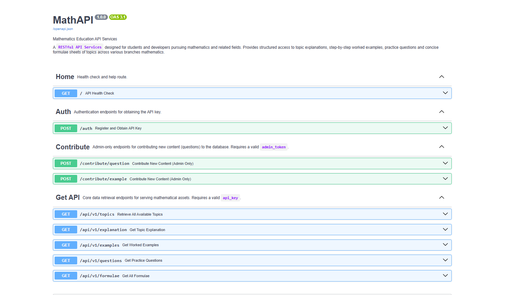

# MathAPI - API Services

[](https://mathapi.vercel.app/docs)



## Introduction
> A RESTful API service designed for students and developers pursuing mathematics and related fields. Provides structured access to topic explanations, step-by-step worked examples, practice questions, and concise formula sheets across various branches of mathematics.

---

## Features

### Topic Catalog
Browse all available mathematics topics with metadata including difficulty level, branch classification, prerequisites, and related topics.

### Detailed Explanations
Get in-depth topic explanations covering definitions, origins, real-world applications, and step-by-step breakdowns.

### Worked Examples
Access fully solved examples with key observations, concept mappings, formula references, and solution interpretations.

### Practice Questions
Retrieve multiple-choice questions with difficulty and type filters to test your understanding.

### Formula Sheets
Fetch concise formula collections for any topic in both plain text and LaTeX format.

### API Key Authentication
Register with a username and email to receive a unique API key for authenticated access.

### Admin Contribution
Authorized admins can contribute new questions and examples directly to the database.

### Rich Metadata
Each topic response includes counts of available explanations, examples, questions, formulae, and learning sources.

### Interactive Docs
Full Swagger UI at `/docs` and ReDoc at `/redoc`.

---

## Routes

| Method | Endpoint | Description | Auth Required |
|--------|----------|-------------|:---:|
| `GET` | `/` | API health check with service info and quick-start guide | ❌ |
| `POST` | `/auth` | Register with username + email, receive an API key | ❌ |
| `GET` | `/api/v1/topics` | List all topics with metadata and resource counts | ✅ |
| `GET` | `/api/v1/explanation` | Get topic explanation with optional formulae, examples, questions, sources | ✅ |
| `GET` | `/api/v1/examples` | Get worked examples for a topic | ✅ |
| `GET` | `/api/v1/questions` | Get practice questions with optional difficulty & type filters | ✅ |
| `GET` | `/api/v1/formulae` | Get all formulae for a topic (plain text + LaTeX) | ✅ |
| `POST` | `/contribute/question` | Admin-only — contribute a new question to the database | 👑 |
| `POST` | `/contribute/example` | Admin-only — contribute a new example to the database | 👑 |

### Quick Start

```bash
# Get your API key
curl -X POST "https://mathapi.vercel.app/auth" \
  -H "Content-Type: application/json" \
  -d '{"username": "your_username", "email": "your@email.com"}'

# Use the API key to access topics
curl -X "https://mathapi.vercel.app/api/v1/topics?api_key=YOUR_API_KEY"

# Explore a specific topic
curl -X "https://mathapi.vercel.app/api/v1/explanation?api_key=YOUR_API_KEY&topic_id=quadratic-equation"
```

---

## Project Structure

```
MathAPI/
├── backend/
│   ├── main.py                     # FastAPI app entry point
│   ├── .env                        # Environment variables (not tracked) 
│   ├── controllers/
│   │   └── auth/                   # User registration logic
│   │       └── auth.py
│   │   └── contribute/             # Admin contribution logic
│   │       ├── question.py
│   │       └── example.py
│   │   └── api/
│   │       └── v1/                 # Main Backend Logic
│   │
│   ├── models/
│   │   ├── home.py                 # Home response schema
│   │   └── auth/                   # Auth request/response schemas
│   │       └── auth.py
│   │   └── contribute/             # Contribution schemas
│   │       ├── question.py
│   │       └── example.py
│   │   ├── api/
│   │   │   └── v1/                 # API response Pydantic models
│   │   └── components/
│   │       ├── helpers.py          # Shared enums and base models
│   │       └── main.py             # Composite models (Topic, Question, Explain)
│   │
│   ├── routes/
│   │   ├── home.py                 # GET /
│   │   └── auth/
│   │       └── auth.py             # POST /auth
│   │   └── contribute/
│   │       ├── question.py         # POST /contribute/question
│   │       └── example.py          # POST /contribute/example
│   │   └── api/
│   │       └── v1/
│   │           ├── get_topics.py   # GET /topics
│   │           ├── explanation.py  # GET /explain
│   │           ├── examples.py     # GET /examples
│   │           ├── questions.py    # GET /questions
│   │           └── formulae.py     # GET /formulae
│   │
│   └── utils/
│       ├── config.py               # Settings from .env
│       ├── database.py             # MongoDB connection & helpers
│       └── helpers.py              # API key generation & verification
│
├── requirements.txt                # Dependency management
├── vercel.json                     # Vercel deployment config
└── README.md                       # Documentation
```

---

## Tech Stack

| Category | Technology |
|----------|-----------|
| **Framework** | [FastAPI](https://fastapi.tiangolo.com/) — Python web framework |
| **Server** | [Uvicorn](https://www.uvicorn.org/) — ASGI server |
| **Database** | [MongoDB](https://www.mongodb.com/) via [PyMongo](https://pymongo.readthedocs.io/) |
| **Validation** | [Pydantic v2](https://docs.pydantic.dev/) — data validation & settings |
| **Auth** | API key-based (SHA-256 hashed with **secrets.token_urlsafe**) |
| **Deployment** | [Vercel](https://vercel.com/) — serverless Python functions |
| **Environment** | Python 3.12+, managed with [uv](https://docs.astral.sh/uv/) |

---

## Contribution

### For Users
Found a bug or have a feature request? Open an issue on the [GitHub repository](https://github.com/TanishkBhatt/MathAPI).

### For Admins
Contribute questions directly to the database via the authenticated endpoint:

```bash
curl -X POST "https://mathapi.vercel.app/contribute/question?admin_token=YOUR_ADMIN_TOKEN" \
  -H "Content-Type: application/json" \
  -d '{
    "topic_id": "quadratic-equation",
    "question": "Your question here...",
    "difficulty": "Intermediate",
    "question_type": ["Conceptual"],
    "options": {"A": "...", "B": "...", "C": "...", "D": "..."},
    "expected_time_limit": "2 min",
    "hint": "Think about...",
    "answer": "A",
    "solution_sources": [{"source": "Textbook", "type": "Book", "link": "..."}]
  }'
```

---

## Author
**Tanishk Bhatt** — A Student and A Programmer

[](https://tanishkbhatt.vercel.app)

---